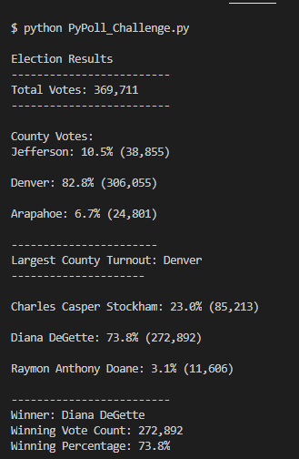
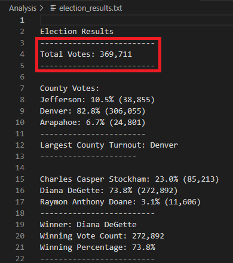
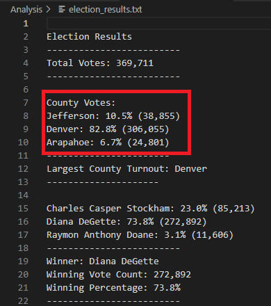
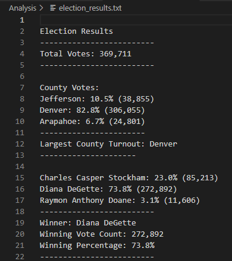
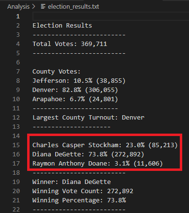
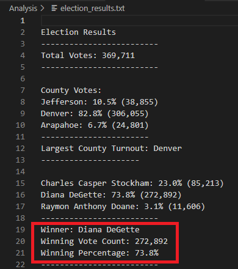

# Election_Analysis

**Overview of Election Audit**

**Election Audit Results**

   

   o	How many votes were cast in this congressional election?  
 

        
   o	Provide a breakdown of the number of votes and the percentage of total votes for each county in the precinct.  
 
        
   o	Which county had the largest number of votes?  
  
        
   o	Provide a breakdown of the number of votes and the percentage of the total votes each candidate received.  

       
   o	Which candidate won the election, what was their vote count, and what was their percentage of the total votes?  

**Election Audit Summary**

Give at least two examples of how this script can be modified to be used for other elections.
